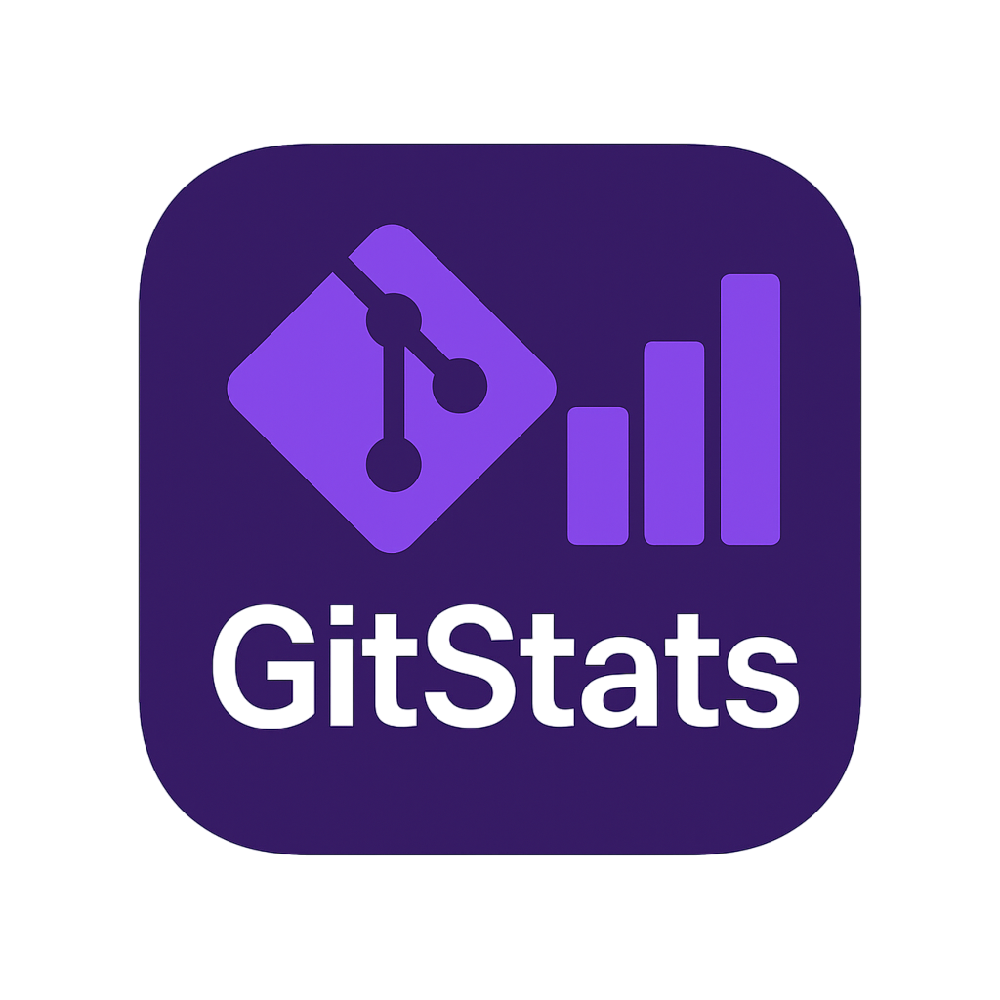

# GitStats Desktop

<p align="left">
  
</p>

**GitStats Desktop** 是一款跨平台的 Git 仓库分析和可视化工具，基于 Kotlin Multiplatform (KMP) 和 Compose Multiplatform (CMP) 开发，帮助你通过交互式图表深入了解代码库和开发活动。

---

## 为什么选择 GitStats？

目前市面上有一些 Git 统计工具（如 [py gitstats](https://pypi.org/project/gitstats/)），但它们往往：

- 使用 Python 技术栈，缺乏现代 UI/UX
- 缺乏维护与更新

**GitStats Desktop** 通过以下方式解决了这些问题：

- 采用现代技术：Kotlin Multiplatform 与 Compose 桌面 UI
- 原生支持 **macOS** 和 **Windows**
- 提供流畅且互动性强的 Git 数据可视化

---

## 主要功能

### 概览
- 项目名称及报告生成时间
- 分析周期与项目年龄
- 文件总数及代码行数（新增/删除）
- 提交总数及每日提交平均值
- 作者人数及人均提交数

### 活动
- 过去一周的代码行和提交变化
- 编码时间热力图（活跃时间和工作日分布）
- 最近活动中改动最多的文件

### 作者
- 按提交数和代码行变化排名的主要贡献者
- 各贡献者的活跃趋势

### 文件
- 文件大小随时间的变化
- 各类型文件的大小汇总

### 代码行
- 代码行数变化趋势（新增与删除）
- 代码总量净增长趋势

### 标签
- 标签信息汇总：名称、日期、标签作者、提交 SHA 和备注

---

## 技术栈

- **Kotlin Multiplatform**（基于 JVM 的核心分析）
- **Compose Multiplatform** 用于 UI
- **Git 命令行工具** 用于仓库数据解析

---

## 使用

```bash
git clone https://github.com/WJRye/kmp-gitstats.git
cd kmp-gitstats
./gradlew run