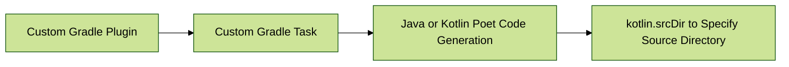
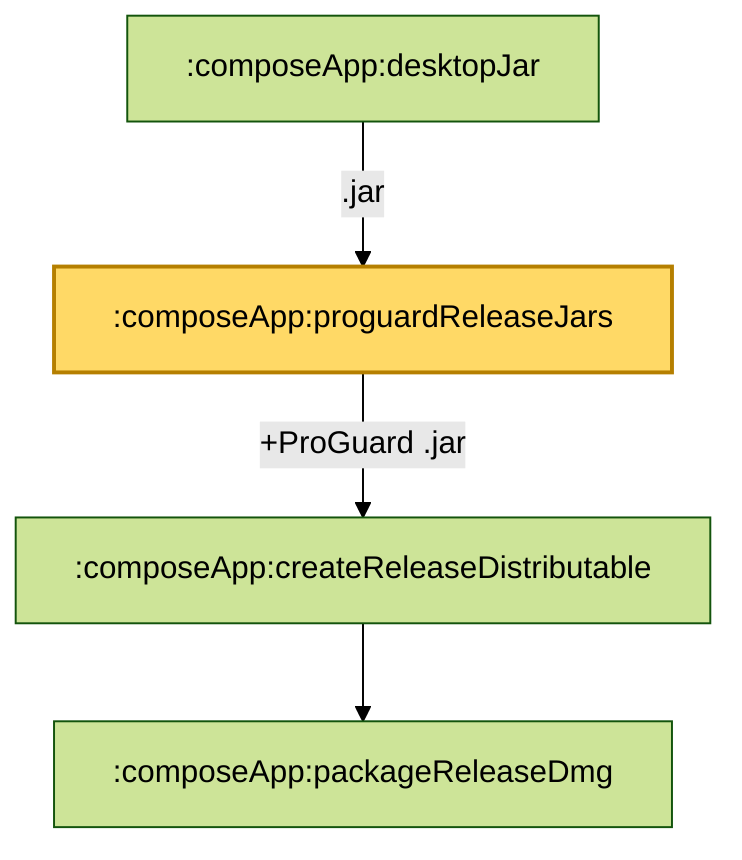
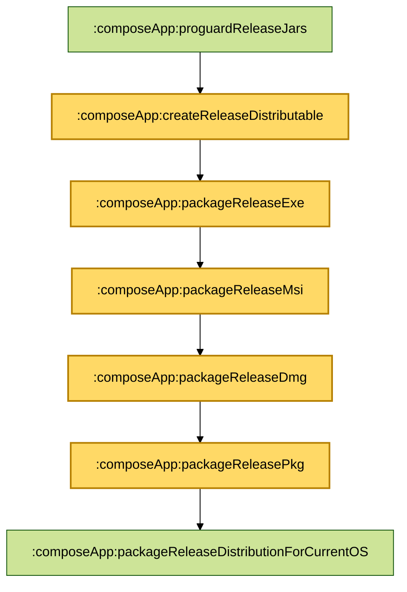
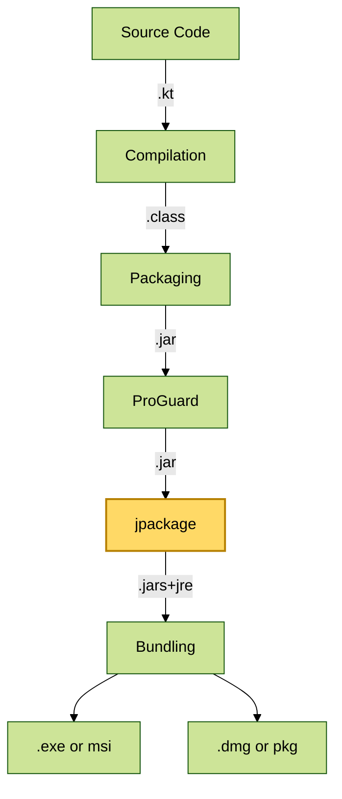

# KMP & CMP Desktop App Build Guide

## Foreword

I've been working on a PC project for a while now. To create a PC application that runs on both Windows and Mac, we typically use C++ and the Qt framework.

- **C++**: We use its standard libraries for common functionality and direct system interaction. It handles platform-independent core logic like algorithms and audio/video codecs.
- **Qt Framework**: We use its cross-platform UI and abstraction capabilities to handle the user interface and system adaptations (files, networking, etc.).

The C++ project build process is as follows:


After obtaining the final `.exe` and `.dmg` files, they can be uploaded to the official website for users to download.

Using KMP & CMP to develop a desktop app also results in `.exe` and `.dmg` files, but the build process is different:


There's a key difference here compared to mobile development. For mobile apps, you can usually get an Android `apk` and an iOS `ipa` on a Mac using the build toolchain. However, for desktop apps, you can't get a Windows `exe` and a Mac `dmg` from a single machine's toolchain. Therefore, you need both a Windows and a Mac device to build for both platforms.

-----

## Building

Build-related configurations are defined in the `build.gradle.kts` file.

### Compilation

Compilation is the process of converting `.kt` source code into `.class` bytecode.

#### jvmToolchain

`jvmToolchain` is used to specify the JDK version.

```kotlin
kotlin {
    jvmToolchain(17)
}
```

This means that you must use JDK 17 on both Mac and Windows, and also in your CI/CD pipeline. If you use JDK 17 on Mac but not on Windows, you might not encounter compilation errors during development, but they are likely to appear during the release phase. It's crucial to unify the JDK version first.

#### commonMainImplementation

Sometimes you need to add different native dependencies for Mac and Windows in `commonMain`. If you try to include both Mac and Windows libraries in `commonMain.dependencies` at the same time, like this:

```kotlin
kotlin {
    jvmToolchain(17)

    sourceSets {

        commonMain.dependencies {
            //Mac
            implementation(libs.skiko.macos)
            //Win
            implementation(libs.skiko.win)
        }
    }
}
```

This can also lead to compilation errors that only appear during the release phase, especially on Windows.

To resolve this, you can use `commonMainImplementation` to add dependencies to `commonMain` conditionally:

```kotlin
kotlin {
    jvmToolchain(17)

    sourceSets {
        commonMain.dependencies {
            
        }
    }
    //Mac
    listOf(macosArm64(), macosX64()).forEach { _ ->
        dependencies {
            commonMainImplementation(libs.skiko.macos)
        }
    }
    //Win
    mingwX64 {
        dependencies {
            commonMainImplementation(libs.skiko.win)
        }
    }
}
```

#### kotlin.srcDir

`kotlin.srcDir` is used to specify source code directories. Besides the standard directories like `"src/commonMain/kotlin"` or `"src/desktopMain/kotlin"`, you may sometimes need to add automatically generated code. For example, generated config code:

```kotlin
sourceSets {
    val commonMain by getting {
        kotlin.srcDirs("src/commonMain/kotlin")
        kotlin.srcDir(layout.buildDirectory.dir("generated/config/commonMain"))
        dependencies {

        }
    }
}
```

#### BuildConfig

In Android development, you can use `buildConfigField` to add fields to the `BuildConfig` class, such as app version information:

- **VERSION\_NAME**: The version name ("1.0.0").
- **VERSION\_CODE**: The version code (10000100).
- **APPLICATION\_ID**: The unique application identifier (com.example.myapplication).

However, in Compose Desktop, there is no `buildConfigField` in `build.gradle.kts`. This requires you to implement your own `BuildConfig`. The general approach is as follows:



Here is a simple implementation:

```kotlin
sourceSets {
    val commonMain by getting {
        kotlin.srcDirs("src/commonMain/kotlin")
        kotlin.srcDir(layout.buildDirectory.dir("generated/config/commonMain"))
        dependencies {

        }
    }
}
// Custom Gradle Task to generate BuildConfig.kt
val generateBuildConfig by tasks.registering {
    group = "build"
    description = "Generates BuildConfig.kt"
    // Directory for the generated class
    val outputDir = layout.buildDirectory.dir("generated/config/commonMain")
    outputs.dir(outputDir)

    val dir = outputDir.get().asFile
    // Read package name and version
    val name = project.rootProject.findProperty("PACKAGE_NAME")
    val version = project.rootProject.findProperty("PACKAGE_VERSION")
    // Path for the generated class
    val configFile = dir.resolve("com/example/myapplication/config/BuildConfig.kt")
    configFile.parentFile.mkdirs()
    configFile.writeText(
        """
            package com.example.myapplication.config

            object BuildConfig {
                const val PACKAGE_NAME = "$name"
                const val PACKAGE_VERSION = "$version"
            }
            """.trimIndent()
    )
}
// Add a task dependency: when `compileKotlinJvm` runs, it triggers `generateBuildConfig`
tasks.findByPath("compileKotlinJvm")?.dependsOn(generateBuildConfig)
```

Configure `gradle.properties`:

```
PACKAGE_NAME=com.example.myapplication
PACKAGE_VERSION=1.0.0
```

Executing `./gradlew run` or `./gradlew runRelease` will generate:

```kotlin
package com.example.myapplication.config

object BuildConfig {
    const val PACKAGE_NAME = "com.example.myapplication"
    const val PACKAGE_VERSION = "1.0.0"
}
```

In your code, you can use it like this:

```kotlin
import com.example.myapplication.config.BuildConfig

BuildConfig.PACKAGE_NAME
```

#### mainClass

`mainClass` specifies the entry point class for your Compose Desktop application. The application will start by executing the `main` method of this class.

```kotlin
Maint.kt

fun main() = application {
    Window(
        onCloseRequest = ::exitApplication,
        title = "${BuildConfig.PACKAGE_NAME} v${BuildConfig.PACKAGE_VERSION}",
        icon = painterResource(Res.drawable.icon)
    ) {
        App()
    }
}
```

Configure it in `build.gradle.kts`:

```kotlin
compose.desktop {
    application {
        mainClass = "com.example.myapplication.MainKt"
        nativeDistributions {
        
        }
    }
}
```

-----

### Packaging

Packaging is the process of converting a `.jar` file into an `.exe` or `.dmg` installer.

#### buildTypes.release.proguard

When building a release version (the `.jar` → `.exe` or `.dmg` stage), you can enable ProGuard for obfuscation, optimization, and other processing via `buildTypes.release.proguard`.

```kotlin
compose.desktop {
    application {
        mainClass = project.rootProject.findProperty("MAIN_CLASS") as String
        nativeDistributions {
            buildTypes.release.proguard {
                version.set("7.2.2") // Specify ProGuard version
                isEnabled.set(true) // Enable ProGuard processing
                obfuscate.set(true) // Obfuscate
                optimize.set(true)  // Optimize
                configurationFiles.from(project.file("proguard-rules.pro")) // Specify ProGuard rule file
            }
        }
    }
}
```

`proguard-rules.pro` specifies rules, for example:

```
# Keep all kotlinx.* classes (e.g., kotlinx.serialization, kotlinx.coroutines)
-keep class kotlinx.** { *; }

# Keep all androidx.* classes (Jetpack Compose UI components)
-keep class androidx.** { *; }
```

When ProGuard is enabled, the `desktopJar` will be processed by the `proguardReleaseJars` task:



#### nativeDistributions

`nativeDistributions` is used to specify platform artifacts, package name, version, icons, signing information, and more.

```kotlin
compose.desktop {
    application {
        mainClass = project.rootProject.findProperty("MAIN_CLASS") as String
        nativeDistributions {
            targetFormats(TargetFormat.Dmg, TargetFormat.Pkg, TargetFormat.Exe, TargetFormat.Msi)
            packageName = project.rootProject.findProperty("PACKAGE_NAME") as String
            packageVersion = project.rootProject.findProperty("PACKAGE_VERSION") as String
            macOS {
                iconFile.set(project.file("src/commonMain/composeResources/drawable/app_icon_mac.icns"))
                bundleID = project.rootProject.findProperty("BUNDLE_ID") as String
                signing {
                    sign.set(true)
                    identity.set("Developer ID Application: Your Name (TEAMID)")
                }
            }
            windows {
                iconFile.set(project.file("src/commonMain/composeResources/drawable/app_icon_win.ico"))
                menuGroup = project.rootProject.findProperty("MENU_GROUP") as String
                upgradeUuid = project.rootProject.findProperty("UPGRADE_UUID") as String
            }
        }
    }
}
```

- `targetFormats(...)`: Specifies the platform artifacts to generate. For Mac: `Dmg`, `Pkg`; for Windows: `Exe`, `Msi`.
- `packageName`: The name of the artifact.
- `packageVersion`: The version of the artifact.

**macOS**:

- `iconFile`: Specifies the app icon. The format must be `.icns`. On Mac, you can use `iconutil` to create it. The icon size should be 1024x1024, and for a better visual effect, the content size is recommended to be 80%-90% of the icon size.
- `bundleID`: A unique identifier, which can be the package name.
- `signing`: Signing information.

**Windows**:

- `iconFile`: Specifies the app icon. The format must be `.ico`. You can use a Python script (`from PIL import Image`) to create it.
- `menuGroup`: The name of the directory in the Start menu.
- `upgradeUuid`: A unique identifier for version upgrades, which can also be generated with a Python script. If the UUID is different, the new version will not be able to overwrite the old one, as they will be treated as different applications.
- **Signing**: Use the official Microsoft tool, [`signtool.exe`](https://www.google.com/search?q=%5Bhttps://learn.microsoft.com/en-us/dotnet/framework/tools/signtool-exe%5D\(https://learn.microsoft.com/en-us/dotnet/framework/tools/signtool-exe\)).

#### jpackage

In Compose Desktop development, [`jpackage`](https://www.google.com/search?q=%5Bhttps://docs.oracle.com/en/java/javase/17/docs/specs/man/jpackage.html%5D\(https://docs.oracle.com/en/java/javase/17/docs/specs/man/jpackage.html\)) is used to bundle the `.jar` into platform artifacts like `.exe` or `.dmg`.

**jpackage** is involved in these tasks:



The **jpackage** works by packaging the application JARs and a JRE (JVM + Libraries) together, and then bundling them into a platform-specific executable like an `.exe` or `.dmg`. **This means that an `.exe` or `.dmg` opened on a Windows or Mac machine is actually running in a JVM environment.**

When you run the `./gradlew packageReleaseDistributionForCurrentOS --info` task, the output will show:

```
Starting process 'command '/Users/xxx/Library/Java/JavaVirtualMachines/corretto-17.0.11/Contents/Home/bin/jpackage''. Working directory: /Users/xxx/Public/software/android-workplace/kmp-gitstats/composeApp Command: /Users/xxx/Library/Java/JavaVirtualMachines/corretto-17.0.11/Contents/Home/bin/jpackage @/Users/wangjiang/Public/software/android-workplace/kmp-gitstats/composeApp/build/compose/tmp/createReleaseDistributable.args.txt
Successfully started process 'command '/Users/xxx/Library/Java/JavaVirtualMachines/corretto-17.0.11/Contents/Home/bin/jpackage''
```

The `jpackage` command and its arguments are stored in the `composeApp/build/compose/tmp/createReleaseDistributable.args.txt` file.

-----

### CI/CD

In a CI/CD pipeline, the `.yml` configuration file must first specify JDK 17. For the **build** stage, both Mac and Windows can use the Gradle task `./gradlew packageDistributionForCurrentOS`. For the **release** stage, they can use `./gradlew packageReleaseDistributionForCurrentOS`. The build artifacts will be located in the `./composeApp/build/compose/binaries` directory.

For example, here's the GitHub Actions workflow configuration:

`.github/workflows/build.yml`:

```yml
name: Build GitStats Desktop

on:
  push:
    branches: [main]
  pull_request:
    branches: [main]

jobs:
  build-macos:
    runs-on: macos-latest
    steps:
      - uses: actions/checkout@v3

      - name: Set up JDK 17
        uses: actions/setup-java@v3
        with:
          distribution: temurin
          java-version: 17

      - name: Build macOS distribution
        run: ./gradlew packageDistributionForCurrentOS

  build-windows:
    runs-on: windows-latest
    steps:
      - uses: actions/checkout@v3

      - name: Set up JDK 17
        uses: actions/setup-java@v3
        with:
          distribution: temurin
          java-version: 17

      - name: Build Windows distribution
        run: ./gradlew packageDistributionForCurrentOS
```

`.github/workflows/release.yml`:

```yml
name: Build & Release GitStats Desktop

on:
  push:
    branches:
      - main
      - 'release/**'
    tags:
      - 'v*'

jobs:
  build:
    runs-on: ${{ matrix.os }}
    strategy:
      matrix:
        os: [macos-latest, windows-latest]

    steps:
      - uses: actions/checkout@v3

      - name: Set up JDK 17
        uses: actions/setup-java@v3
        with:
          distribution: temurin
          java-version: 17

      - name: Build for ${{ matrix.os }}
        run: ./gradlew packageReleaseDistributionForCurrentOS

      - name: Find generated artifacts
        id: find-package
        run: |
          echo "files=$(find ./composeApp/build/compose/binaries -type f ( -name '*.dmg' -o -name '*.exe' ) | tr '\n' ' ')" >> $GITHUB_OUTPUT
        shell: bash

      - name: Upload to GitHub Release
        uses: softprops/action-gh-release@v1
        with:
          files: ${{ steps.find-package.outputs.files }}
        env:
          GITHUB_TOKEN: ${{ secrets.GITHUB_TOKEN }}
```

-----

## Summary

The build process for a desktop app using KMP & CMP is:



The final artifacts (`.exe` or `.dmg`) created locally are fundamentally different from those built with Kotlin/Native. The former run in a **JVM environment**, while the latter run as **native executables** in the host environment.